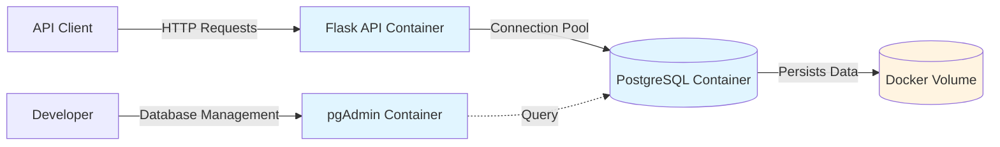

# Flask + PostgreSQL REST API

**Project Goal:** Build a production-ready multi-container application demonstrating Docker orchestration, database integration, and modern Python API development patterns.

## Problem Statement

Building a containerized API with persistent database storage requires understanding container networking, volume management, environment configuration, and production deployment patterns. This project demonstrates these core DevOps skills through a working REST API.

## Solution

Three-service Docker Compose stack:
- Flask REST API with psycopg3 connection pooling
- PostgreSQL database with automated schema initialization
- pgAdmin for database management and monitoring

## Architecture



## Tech Stack

- **Backend**: Python 3.14, Flask, psycopg3
- **Database**: PostgreSQL 18
- **Server**: Granian WSGI server
- **Management**: pgAdmin 4
- **Orchestration**: Docker Compose

## Features

- RESTful API with full CRUD operations
- Connection pooling for database efficiency
- Health check endpoints (app + database)
- JSON structured logging
- Dynamic SQL with parameter validation
- Automated database initialization
- Resource limits and restart policies

## API Endpoints

- `GET /health` - Application and database health checks
- `GET /items` - List all items
- `GET /items/<id>` - Get specific item
- `POST /items` - Create new item
- `PUT /items/<id>` - Update item
- `PATCH /items/<id>` - Partial update
- `DELETE /items/<id>` - Delete item

## Setup

1. Copy environment file:
   ```bash
   cp .env.example .env
   ```

2. Start services:
   ```bash
   docker compose up -d
   ```

3. Test the API:
   ```bash
   curl http://localhost:5000/health
   ```

4. Access pgAdmin:
   - URL: http://localhost:5050
   - Login with credentials from `.env`

## Development

**View logs:**
```bash
docker compose logs -f flask-api
```

**Access database:**
```bash
docker compose exec postgres psql -U postgres -d appdb
```

**Restart services:**
```bash
docker compose restart
```

## Production Patterns Implemented

- **Non-root containers**: Services run as unprivileged users
- **Health checks**: Docker monitors service availability
- **Resource limits**: Memory and CPU constraints prevent resource exhaustion
- **Restart policies**: Containers automatically recover from failures
- **Connection pooling**: Efficient database connection management
- **Structured logging**: JSON logs for centralized log aggregation
- **Dependency management**: pip-tools with locked requirements

## Why This Matters

**This project demonstrates:**
- **Docker orchestration**: Multi-container applications with service dependencies and networking
- **Production readiness**: Health checks, logging, resource management, and security best practices
- **Database operations**: Connection pooling, migrations, and persistent storage
- **API development**: RESTful design, error handling, and proper HTTP semantics
- **Operational skills**: Container debugging, log analysis, and service management

## Key Learnings

- PostgreSQL permission model (database vs schema privileges)
- Docker Compose networking and service discovery
- Connection pooling for production database access
- Dynamic SQL construction with proper parameterization
- Health check patterns for containerized services
