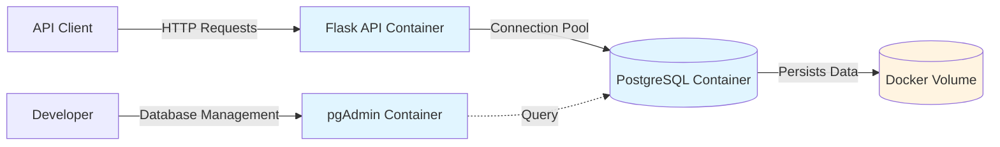

```mermaid
flowchart LR
    Client[API Client] -->|HTTP Requests| Flask[Flask API Container]
    Flask -->|Connection Pool| Postgres[(PostgreSQL Container)]
    Admin[Developer] -->|Database Management| pgAdmin[pgAdmin Container]
    pgAdmin -.->|Query| Postgres
    Postgres -->|Persists Data| Volume[(Docker Volume)]
    
    style Flask fill:#e1f5ff
    style Postgres fill:#e1f5ff
    style pgAdmin fill:#e1f5ff
    style Volume fill:#fff4e1
```
