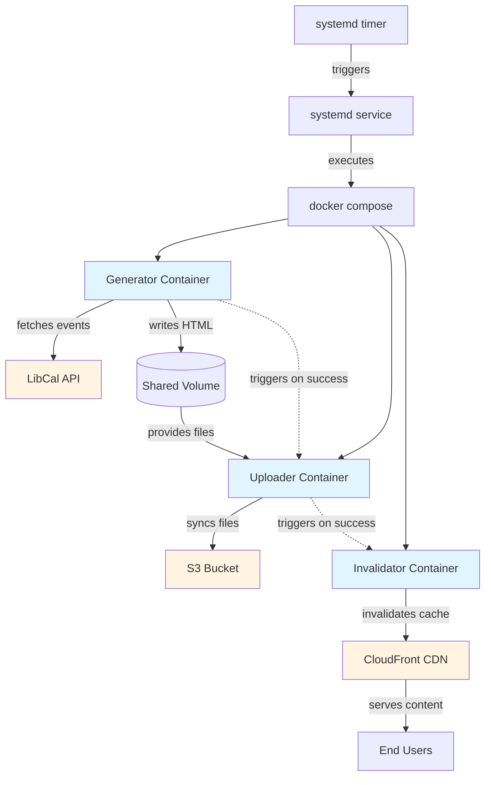

# Events Display - Lambda to Docker Migration

**Project Goal:** Migrate a serverless AWS Lambda application to a containerized multi-service architecture, demonstrating reduced operational complexity and improved developer experience.

## Problem Statement

The original Lambda implementation created operational friction in three key areas: dependency management required building and deploying custom Lambda layers for Python packages, debugging relied solely on CloudWatch logs with no local testing capability, and the codebase required Lambda-specific modifications (handling container caching, /tmp directory restrictions, and execution context limitations) that reduced code portability and increased maintenance overhead.

## Solution
Multi-container Docker Compose pipeline with:
- Python generator (fetches events, creates HTML)
- AWS CLI uploader (S3 sync)
- CloudFront invalidator (cache refresh)
- Scheduled execution via systemd timer

## Architecture

## Tech Stack
- Docker & Docker Compose
- Python 3.14 (Flask, Jinja2, requests)
- AWS (S3, CloudFront, IAM)
- systemd (scheduling)

## Setup
1. Copy environment file: `cp .env.example .env`
2. Add your credentials to `.env`
3. Build: `docker compose build`
4. Run: `docker compose up`

## Deployment
Runs on Debian VM with systemd scheduling:
- Service file executes Docker Compose pipeline
- Timer triggers every 15 minutes during business hours (Mon-Sat 9am-6pm)
- Logs available via `journalctl -u events-display.service`

## Why This Matters

**Lambda → Docker migration demonstrates:**
- **Operational simplicity**: Eliminated Lambda layers, enabling standard `pip install` workflows and local testing
- **Improved observability**: Structured logging and systemd integration provide clear visibility into pipeline execution and failures
- **Infrastructure portability**: Application runs anywhere Docker runs - local development, VM, or future Kubernetes deployment
- **Production readiness**: Multi-container orchestration with proper dependency management, least-privilege IAM, and scheduled execution
- **Cost awareness**: Understanding when serverless adds value vs when traditional compute is more appropriate

## Live Demo
https://events.leblibrary.com